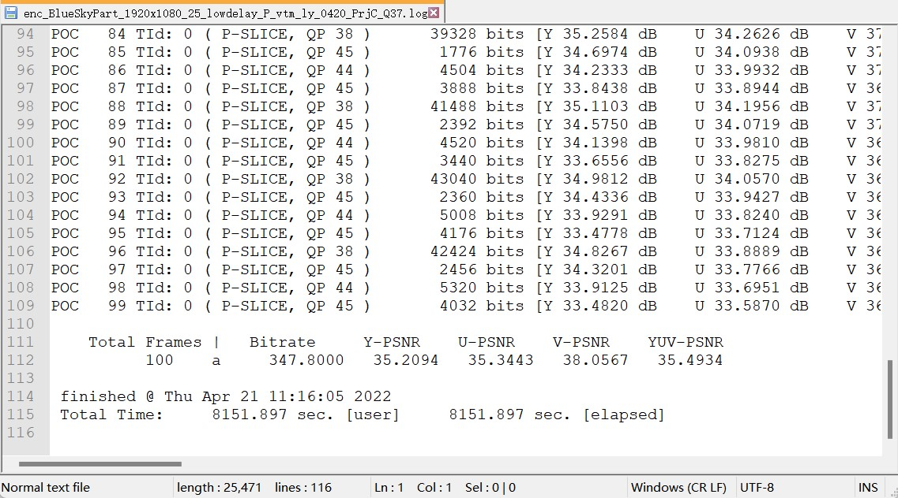
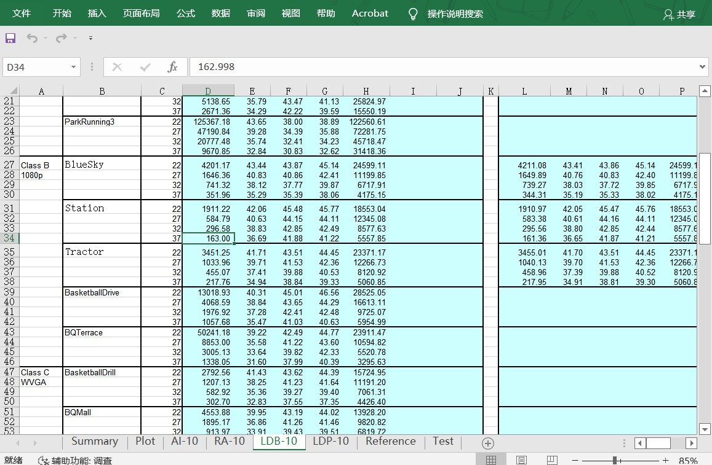
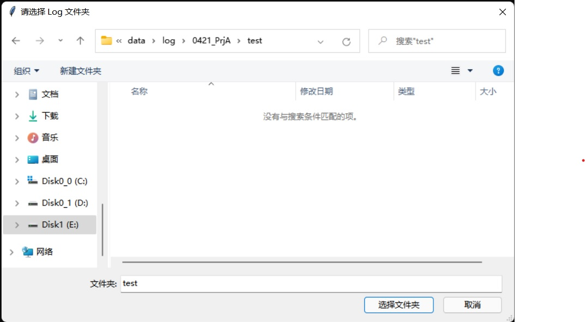

# VTM-EncLogs-FillForm

在进行基于VTM的编解码实验时，为测试编码性能，需要从编码 Log 文件中提取出 Bitrate, Y-SPNR, U-PSNR，V-PSNR 等信息，并将其复制到 VTM 的一个辅助计算 BD-Rate 的 Excell 表格中





手动一个一个 Log 复制太慢了，所以写了一个 Python 程序来自动化实现这个步骤

## Set Up

* Python3.x，使用了 `Tkinter` 这个库来做 Log 路径的选择，然后没啥其他的了

  ```powershell
  python ./main.py
  ```

  也提供了 .exe 文件， Windows 下直接双击应用，然后在弹出的对话框里选择 Log 的路径即可

  

## 对 Log 文件夹的要求

* 代码中使用了正则表达式从 log 文件名称中提取测试序列名称、QP等信息，与代码配套的 log 如下所示


* 使用到的正则

  ```python
  pattenLogName = re.compile(r'enc_\w+\.log')
  pattenSeqName = re.compile(r'enc_(\w+)_(lowdelay_P|lowdelay|randomaccess|intra)_\w+\.log')
  pattenQp = re.compile(r'Q(\d{1,3}).log')
  ```

  可以根据自己实验室的命名规范修改正则表达式

  ***

  下面是从 VTM 标准 log 提取信息的正则，不需要修改

  ```python
  pattenTestName = re.compile(r'((lowdelay_P|lowdelay|randomaccess|intra)\w+)_Q\d+')
  pattenLogBDStas = re.compile(r'\b\d+\s*a\s*(\d+\.\d+)\s*(\d+\.\d+)\s*(\d+\.\d+)\s*(\d+\.\d+)\s*(\d+\.\d+)\b')
  pattenLogTimeStas = re.compile(r'\bTotal Time:\s*(\d+\.\d+)[^0-9]+(\d+\.\d+)\b')
  ```

## 运行结果

如果一切顺利的话，程序运行完后弹出 log 文件夹，文件夹下会有一个 `form-xxx-xxx.csv`，就是生成的汇总啦


***

